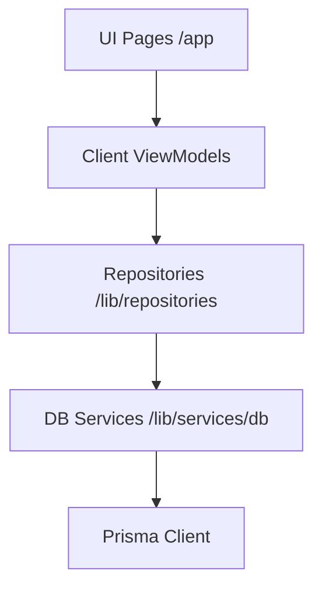

# Program Summary - Arunika App

Arunika is an AI-driven, competency-based educational evaluation and learning application. This document catalogs the system architecture, user roles, database schemas, and workflows.

---

## 1. User Roles & Use Cases

### A. Admin
* **Curriculum Upload**: Uploads curriculum documents (PDFs) to build a global database of competencies (`KompetensiPelajaran`).
* **Tenancy & User Management**: Manages schools, classes, teachers, and student memberships.

### B. Guru (Teacher)
* **Book & Chapter Management**: Organizes books and chapters (Bab) and configures learning goals.
* **Competency Management**: Defines local competency definitions (`KompetensiBab`) for each chapter, either manually or by linking them to curriculum standards.
* **Question Bank Operations**: Triggers AI question generation (MCQ or Essay) grouped by competency, and flags (accepts/declines) questions to build a feedback loop for the LLM.
* **Exam Templates Builder**: Configures exam criteria based on competency distributions (question counts and scoring weights) rather than rigid cognitive limits.
* **Essay Grading**: Reviews student essay answers, inputs points, and adds feedback.

### C. Siswa (Student)
* **Adaptive Test Taking**: Takes adaptive exams where question difficulties adjust in real-time based on ELO ratings.
* **AIFeedback Reports**: Views detailed analysis reports on competency ketuntasan (mastery) with weaknesses and learning recommendations.
* **Quiz Game (Eagle's Open Room)**: Plays an interactive competency quiz accompanied by Elang (the Eagle mascot). Features a 20-student queue limit, an AFK idle timer, and AI-driven question selection.

---

## 2. Prisma Database Models

| Model Name | Table Name | Purpose |
| :--- | :--- | :--- |
| `User` | `users` | Accounts for Superadmins, Admins, Teachers (Guru), and Students (Siswa). |
| `Kelas` | `kelas` | Groups students and links them to their teacher. |
| `Buku` | `buku` | Educational textbook belonging to a teacher. |
| `Bab` | `bab` | Textbook chapters containing learning goals. |
| `KompetensiPelajaran` | `kompetensi_pelajaran` | Global curriculum repository uploaded by Admins. |
| `KompetensiBab` | `kompetensi_bab` | Editable competency descriptions mapped to textbook chapters. |
| `BankSoal` | `bank_soal` | Question bank (MCQ/Essay) linked to competencies and status flags. |
| `Ujian` | `ujian` | Exam templates defining competency distribution rules. |
| `UjianTemplateKompetensi` | `ujian_template_kompetensi` | Specific competency criteria (counts/points) for an exam. |
| `JadwalUjian` | `jadwal_ujian` | Active schedules linking an exam template to a classroom. |
| `SesiUjianSiswa` | `sesi_ujian_siswa` | Active student test sessions tracking ELO ratings. |
| `JawabanSiswa` | `jawaban_siswa` | Snapshot of student answers, ELO shifts, and grading points. |
| `QuizSession` | `quiz_session` | Student quiz game instances checking queue limits and AFK times. |
| `SavedResponses` | `saved_responses` | Stores AI-generated student feedback summaries. |
| `TaskQueue` | `task_queue` | Background worker queue for Gemini curriculum parsing and PDF extraction. |

---

## 3. Directory & Architecture Mapping

### A. UI Pages & Client Views
* **Admin Curriculum**: `/admin/kurikulum` & [KurikulumUploadForm.tsx](file:///d:/kuliah/Tugas%20Akhir/ai-overview/arunika-app/src/app/admin/kurikulum/KurikulumUploadForm.tsx)
* **Bab Kompetensi**: `/guru/buku/[id]/bab/[bab_id]/kompetensi` & [KompetensiClientPage.tsx](file:///d:/kuliah/Tugas%20Akhir/ai-overview/arunika-app/src/app/guru/buku/[id]/bab/[bab_id]/kompetensi/KompetensiClientPage.tsx)
* **Exam Builder**: `/guru/ujian/[id]/builder` & [page.tsx](file:///d:/kuliah/Tugas%20Akhir/ai-overview/arunika-app/src/app/guru/ujian/[id]/builder/page.tsx)
* **Essay Grading**: `/guru/reports/attempt/[attempt_id]` & [page.tsx](file:///d:/kuliah/Tugas%20Akhir/ai-overview/arunika-app/src/app/guru/reports/attempt/[attempt_id]/page.tsx)
* **Quiz Lobby**: `/siswa/ujian/[jadwal_id]/quiz/lobby` & [QuizLobbyClient.tsx](file:///d:/kuliah/Tugas%20Akhir/ai-overview/arunika-app/src/app/siswa/ujian/[jadwal_id]/quiz/lobby/QuizLobbyClient.tsx)
* **Quiz Play**: `/siswa/ujian/[jadwal_id]/quiz/play` & [QuizPlayClient.tsx](file:///d:/kuliah/Tugas%20Akhir/ai-overview/arunika-app/src/app/siswa/ujian/[jadwal_id]/quiz/play/QuizPlayClient.tsx)

### B. ViewModels
* **Admin Kurikulum VM**: [KurikulumViewModel.tsx](file:///d:/kuliah/Tugas%20Akhir/ai-overview/arunika-app/src/app/admin/kurikulum/KurikulumViewModel.tsx)
* **Bab Kompetensi VM**: [KompetensiViewModel.tsx](file:///d:/kuliah/Tugas%20Akhir/ai-overview/arunika-app/src/app/guru/buku/[id]/bab/[bab_id]/kompetensi/KompetensiViewModel.tsx)
* **Exam Builder VM**: [GuruFormUjianViewModel.tsx](file:///d:/kuliah/Tugas%20Akhir/ai-overview/arunika-app/src/app/guru/ujian/[id]/builder/GuruFormUjianViewModel.tsx)
* **Quiz Lobby VM**: [QuizLobbyViewModel.tsx](file:///d:/kuliah/Tugas%20Akhir/ai-overview/arunika-app/src/app/siswa/ujian/[jadwal_id]/quiz/lobby/QuizLobbyViewModel.tsx)
* **Quiz Play VM**: [QuizPlayViewModel.tsx](file:///d:/kuliah/Tugas%20Akhir/ai-overview/arunika-app/src/app/siswa/ujian/[jadwal_id]/quiz/play/QuizPlayViewModel.tsx)

### C. Repositories (`src/lib/repositories/`)
* **`adminRepository.ts`**: Fetches stats, users, and initiates curriculum extraction.
* **`guruRepository.ts`**: Manages books, chapters, competencies, and exam templates.
* **`siswaRepository.ts`**: Handles active exam lobbies, ELO updates, and history list.
* **`quizRepository.ts`**: Handles queue requests, session activity, and AI quiz agent prompts.

### D. Database Actions (`src/lib/services/db/`)
* **`adminDB.ts`**: Direct DB queries for schools, user stats, and curriculum listings.
* **`guruDB.ts`**: DB operations for textbook contents, manual competency mappings, and exam criteria transactions.
* **`siswaDB.ts`**: Test session logs, answers snapshotting, and student details.
* **`quizDB.ts`**: Transaction-safe queue reservation, session activity timestamps, and AFK timers.
